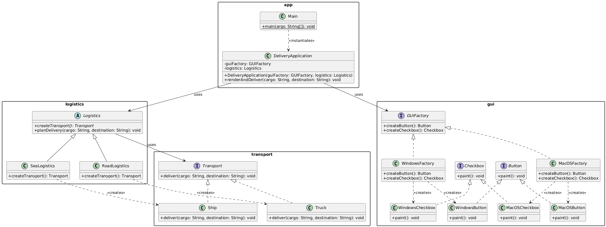

# Assignment 2: Creational Design Patterns (Factory Method & Abstract Factory)

**Course:** Software Design Patterns  
**Student:** Irangait Yerassyl  
**Institution:** Astana IT University

---

##  Project Overview
This project is a Java 17 console application that demonstrates the practical implementation and integration of two classic GoF Creational Design Patterns:
1. **Factory Method:** Used for handling logistics operations (`RoadLogistics` vs `SeaLogistics`) and instantiating corresponding transport types (`Truck` vs `Ship`).
2. **Abstract Factory:** Used for rendering cross-platform GUI components (`WindowsFactory` vs `MacOSFactory`) creating matched UI elements (`Button` and `Checkbox`).

---

##  Architecture & UML Diagram

The diagram below illustrates the decoupled structure between client code, creational factories, and product interfaces.



---

##  Package Structure

- `transport`: Contains `Transport` interface and concrete products (`Truck`, `Ship`).
- `logistics`: Contains abstract creator `Logistics` and concrete creators (`RoadLogistics`, `SeaLogistics`).
- `gui`: Contains Abstract Factory `GUIFactory`, platform factories (`WindowsFactory`, `MacOSFactory`), and UI components.
- `app`: Client layer containing `DeliveryApplication` and entry point `Main`.

---

##  Test Execution & Input Validation

The application handles dynamic user input via standard input (`Scanner`) with robust error handling for unsupported parameters.

### Sample Execution Output:
```text
Enter delivery mode (ROAD / SEA): ROAD
Enter platform (WINDOWS / MACOS): WINDOWS

Rendering Windows button
Rendering Windows checkbox
Truck delivers laboratory equipment to Aktau warehouse
```

---

## Prerequisites & How to Run
1. **JDK Version: Java 17 or higher.**
2. **Compile**
```bash
javac -d bin src/transport/*.java src/logistics/*.java src/gui/*.java src/app/*.java
```
3. **Run**
```bash
java -cp bin app.Main
```
